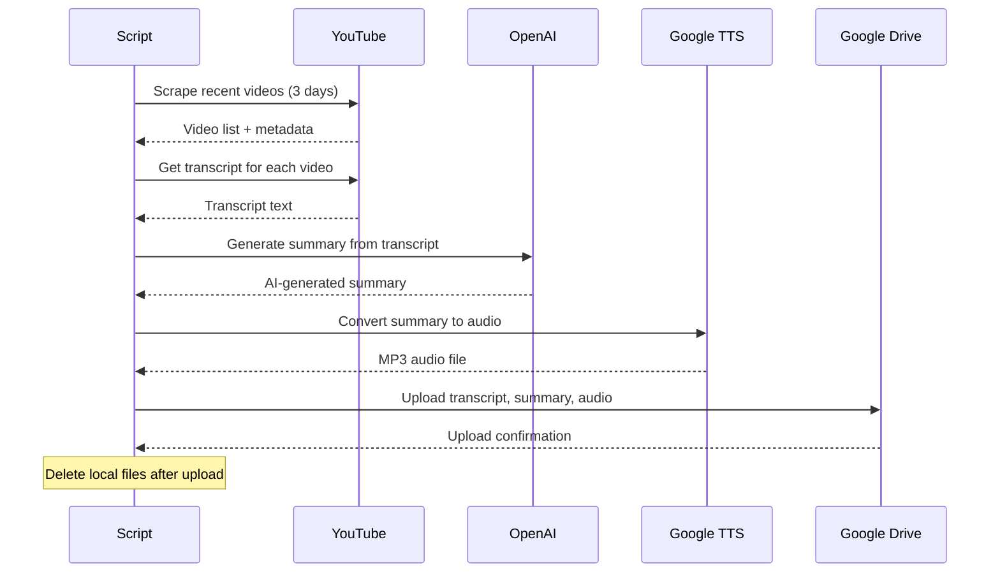

# YouTube Transcript Processor

An automated Python application that processes YouTube channels to extract transcripts, generate AI-powered summaries, create audio versions, and organize everything in Google Drive.

## 🚀 Features

- **Multi-Channel Processing**: Process multiple YouTube channels simultaneously
- **Smart Filtering**: Only processes videos from the last 3 days to focus on recent content
- **Transcript Extraction**: Downloads YouTube transcripts with language preferences
- **AI Summarization**: Generates comprehensive summaries using OpenAI GPT models
- **Text-to-Speech**: Converts summaries to high-quality MP3 audio using Google Cloud TTS
- **Cloud Storage**: Automatically uploads all files to organized Google Drive folders
- **Duplicate Prevention**: Tracks processed videos to avoid reprocessing
- **Error Handling**: Robust error handling with detailed logging

## 🔄 How It Works



## 📁 Project Structure

```
YT/
├── new_main.py           # Main application script
├── config.yaml          # Configuration file
├── logs/                 # Application logs
├── channels/            # Local processing folder (temporary)
└── google.json          # Google Cloud service account credentials
```

## 🛠️ Prerequisites

### Required Services
1. **OpenAI API Key** - For AI summary generation
2. **Google Cloud Project** with:
   - Text-to-Speech API enabled
   - Drive API enabled
   - Service account with credentials JSON file

### System Requirements
- Python 3.9+
- FFmpeg (for audio processing)

## 📦 Installation

### 1. Clone the Repository
```bash
git clone https://github.com/yvh1223/youtube-transcript-processor.git
cd youtube-transcript-processor
```

### 2. Quick Setup (Recommended)
```bash
python setup.py
```
This automated script will:
- Check Python version and FFmpeg
- Create virtual environment
- Install dependencies
- Set up configuration files
- Create necessary directories

### 3. Manual Setup
```bash
# Create Virtual Environment
python -m venv venv
source venv/bin/activate  # On macOS/Linux
# or
venv\Scripts\activate     # On Windows

# Install Dependencies
pip install -r requirements.txt

# Copy configuration files
cp config.yaml.example config.yaml
cp .env.example .env
```

### 4. Install FFmpeg
**macOS (with Homebrew):**
```bash
brew install ffmpeg
```

**Windows:**
- Download from https://ffmpeg.org/
- Add to system PATH

**Linux:**
```bash
sudo apt update
sudo apt install ffmpeg
```

## ⚙️ Configuration

### 1. Create `config.yaml`
```yaml
channels:
  - "channel_username1"
  - "channel_username2"
  - "channel_username3"

preferred_languages:
  - "en"
  - "en-US"

html_formatting: true
file_name_max_length: 30
file_name_timestamp: true
```

### 2. Set Up Environment Variables
Create a `.env` file:
```env
OPENAI_API_KEY=your_openai_api_key_here
GOOGLE_APPLICATION_CREDENTIALS=./google.json
```

### 3. Google Cloud Setup
1. Create a Google Cloud project
2. Enable Text-to-Speech and Drive APIs
3. Create a service account
4. Download the JSON credentials file as `google.json`
5. Share your target Google Drive folder with the service account email

## 🚀 Usage

### Basic Usage
```bash
python new_main.py
```

### What the Script Does
1. **Scrapes** recent videos (last 3 days) from configured YouTube channels
2. **Downloads** transcripts for each video
3. **Generates** AI summaries using OpenAI
4. **Creates** audio versions of summaries using Google TTS
5. **Uploads** all files to organized Google Drive folders:
   ```
   YTTranscript/
   ├── Channel1/
   │   ├── Transcripts/
   │   ├── Summaries/
   │   └── Audio/
   └── Channel2/
       ├── Transcripts/
       ├── Summaries/
       └── Audio/
   ```

## 📊 Output Files

For each processed video, the script creates:
- **Transcript** (`.txt`) - Raw YouTube transcript
- **Summary** (`.txt`) - AI-generated comprehensive summary
- **Audio** (`.mp3`) - Text-to-speech version of the summary

Files are named with format: `{video_title}_{YYYYMMDD}.txt/mp3`

## 🔧 Customization

### Modify Processing Window
Change the time window for video processing in `new_main.py`:
```python
if time_delta > timedelta(days=3):  # Change from 3 to desired days
```

### Adjust AI Summary Settings
Modify the OpenAI model and parameters:
```python
model="gpt-4.1-nano",  # Change model
max_tokens=4000,       # Adjust token limit
temperature=0.5,       # Adjust creativity
```

### TTS Voice Settings
Customize the voice in `synthesize_chunk()`:
```python
voice = texttospeech.VoiceSelectionParams(
    language_code="en-US",
    name="en-US-Standard-B",  # Try different voices
    ssml_gender=texttospeech.SsmlVoiceGender.NEUTRAL,
)
```

## 📝 Logging

The application creates detailed logs in `logs/app.log` including:
- Processing status for each video
- Error messages and debugging information
- Upload confirmations
- Performance metrics

## 🛠️ Troubleshooting

### Common Issues

**FFmpeg not found:**
```bash
# Install FFmpeg and restart terminal
brew install ffmpeg  # macOS
```

**OpenSSL warnings:**
```python
# Add to top of script to suppress warnings
import warnings
warnings.filterwarnings('ignore', category=UserWarning, module='urllib3')
```

**Google API errors:**
- Verify service account permissions
- Check API quotas in Google Cloud Console
- Ensure credentials file path is correct

**Rate limiting:**
- The script includes automatic retry logic
- YouTube API has rate limits - script will pause and resume

## 🤝 Contributing

1. Fork the repository
2. Create a feature branch
3. Make your changes
4. Add tests if applicable
5. Submit a pull request

See [CONTRIBUTING.md](CONTRIBUTING.md) for detailed guidelines.

## 📄 License

This project is licensed under the MIT License - see the [LICENSE](LICENSE) file for details.

## ⚠️ Disclaimer

This tool is for educational and personal use. Ensure you comply with:
- YouTube's Terms of Service
- OpenAI's Usage Policies
- Google Cloud Platform Terms
- Applicable copyright laws

## 🆘 Support

If you encounter issues:
1. Check the [troubleshooting section](#-troubleshooting)
2. Review logs in `logs/app.log`
3. Open an issue with detailed error information
4. Check [CHANGELOG.md](CHANGELOG.md) for recent updates

---

**Built with ❤️ for automated content processing**
