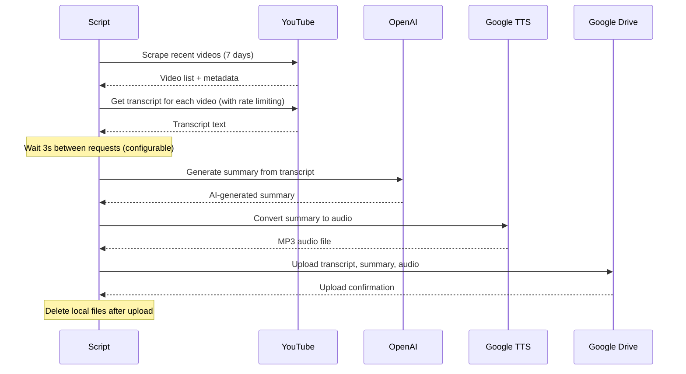

# YouTube Transcript Processor

An automated Python application that processes YouTube channels to extract transcripts, generate AI-powered summaries, create audio versions, and organize everything in Google Drive.

## 🚀 Features

- **Multi-Channel Processing**: Process multiple YouTube channels simultaneously
- **Smart Filtering**: Only processes videos from the last 7 days to focus on recent content (configurable)
- **Intelligent Rate Limiting**: Prevents YouTube IP bans with configurable delays between requests
- **Transcript Extraction**: Downloads YouTube transcripts with language preferences
- **AI Summarization**: Generates comprehensive summaries using OpenAI GPT models
- **Text-to-Speech**: Converts summaries to high-quality MP3 audio using Google Cloud TTS
- **Cost-Optimized TTS**: Uses Standard voices with 4M free characters/month
- **Cloud Storage**: Automatically uploads all files to organized Google Drive folders
- **Duplicate Prevention**: Tracks processed videos to avoid reprocessing
- **Error Handling**: Robust error handling with IP ban detection and helpful recovery suggestions
- **Modular Architecture**: Clean separation of concerns with dedicated modules for each function

## 🔄 How It Works



## 📁 Project Structure

```
youtube-transcript-processor/
├── main.py              # Main application entry point
├── config.yaml          # Configuration file
├── .env                 # Environment variables (not committed)
├── src/                 # Source modules
│   ├── config.py        # Configuration loader
│   ├── youtube_processor.py  # Transcript extraction
│   ├── summarizer.py    # AI summarization
│   ├── tts.py           # Text-to-speech
│   ├── drive_uploader.py     # Google Drive uploads
│   └── utils.py         # Helper functions
├── logs/                # Application logs
├── channels/            # Local processing folder (temporary)
├── archive/             # Archived old code, credentials, and dev files
└── run.sh               # Wrapper script to run with venv
```

## 🛠️ Prerequisites

### Required Services
1. **OpenAI API Key** - For AI summary generation
2. **Google Cloud Project** with:
   - Text-to-Speech API enabled
   - Drive API enabled
   - Service account with credentials JSON file

### System Requirements
- Python 3.9+
- FFmpeg (for audio processing)

## 📦 Installation

### 1. Clone the Repository
```bash
git clone https://github.com/yvh1223/youtube-transcript-processor.git
cd youtube-transcript-processor
```

### 2. Quick Setup (Recommended)
```bash
python setup.py
```
This automated script will:
- Check Python version and FFmpeg
- Create virtual environment
- Install dependencies
- Set up configuration files
- Create necessary directories

### 3. Manual Setup
```bash
# Create Virtual Environment
python -m venv venv
source venv/bin/activate  # On macOS/Linux
# or
venv\Scripts\activate     # On Windows

# Install Dependencies
pip install -r requirements.txt

# Copy configuration files
cp config.yaml.example config.yaml
cp .env.example .env
```

### 4. Install FFmpeg
**macOS (with Homebrew):**
```bash
brew install ffmpeg
```

**Windows:**
- Download from https://ffmpeg.org/
- Add to system PATH

**Linux:**
```bash
sudo apt update
sudo apt install ffmpeg
```

## ⚙️ Configuration

### 1. Create `config.yaml`
```yaml
channels:
  - "channel_username1"
  - "channel_username2"
  - "channel_username3"

preferred_languages:
  - "en"
  - "en-US"

html_formatting: true
file_name_max_length: 30
file_name_timestamp: true
```

### 2. Set Up Environment Variables
Create a `.env` file:
```env
OPENAI_API_KEY=your_openai_api_key_here
GOOGLE_APPLICATION_CREDENTIALS=./archive/gen-lang-client-0074099179-3b8f73266f6f.json
```

### 3. Google Cloud Setup
1. Create a Google Cloud project
2. Enable Text-to-Speech and Drive APIs
3. Create a service account
4. Download the JSON credentials file as `google.json`
5. Share your target Google Drive folder with the service account email

## 🚀 Usage

### Basic Usage
```bash
# Using wrapper script (recommended)
./run.sh         # Runs main.py with venv activated

# Manual (activate venv first)
source venv/bin/activate
python main.py
```

### What the Script Does
1. **Scrapes** recent videos (last 7 days, configurable) from configured YouTube channels
2. **Downloads** transcripts for each video with intelligent rate limiting (3s delays)
3. **Generates** AI summaries using OpenAI GPT-4o-mini
4. **Creates** audio versions of summaries using Google Cloud TTS (Standard voice)
5. **Uploads** all files to organized Google Drive folders:
   ```
   YTTranscript/
   ├── Channel1/
   │   ├── Transcripts/
   │   ├── Summaries/
   │   └── Audio/
   └── Channel2/
       ├── Transcripts/
       ├── Summaries/
       └── Audio/
   ```

## 📊 Output Files

For each processed video, the script creates:
- **Transcript** (`.txt`) - Raw YouTube transcript
- **Summary** (`.txt`) - AI-generated comprehensive summary
- **Audio** (`.mp3`) - Text-to-speech version of the summary

Files are named with format: `{video_title}_{YYYYMMDD}.txt/mp3`

## 🔧 Customization

All customization is done via `config.yaml`:

### Modify Processing Window
```yaml
processing:
  days_back: 7  # Change number of days to look back
```

### Adjust Rate Limiting (Prevent IP Bans)
```yaml
processing:
  rate_limiting:
    delay_between_videos: 3      # Seconds between transcript requests
    delay_between_channels: 5    # Seconds between channel processing
```
**Note**: Increase delays if experiencing YouTube IP bans. For details, see the "API Rate Limiting" section in CLAUDE.md.

### Adjust AI Summary Settings
```yaml
openai:
  model: "gpt-4o-mini"    # Change model (gpt-4o, gpt-4o-mini, etc.)
  max_tokens: 4000        # Adjust token limit
  temperature: 0.5        # Adjust creativity (0.0-1.0)
```

### TTS Voice Settings
```yaml
tts:
  voice_name: "en-US-Standard-B"  # Standard = $4/M, Neural2 = $16/M
  voice_gender: "NEUTRAL"          # NEUTRAL, MALE, FEMALE
  speaking_rate: 1.0               # Speed adjustment (0.25-4.0)
```
**Pricing**: Standard voices provide 4M free chars/month at $4/M after. Neural2 voices cost $16/M with 1M free/month.

## 📝 Logging

The application creates detailed logs in `logs/app.log` including:
- Processing status for each video
- Error messages and debugging information
- Upload confirmations
- Performance metrics

## 🛠️ Troubleshooting

### Common Issues

**FFmpeg not found:**
```bash
# Install FFmpeg and restart terminal
brew install ffmpeg  # macOS
```

**OpenSSL warnings:**
```python
# Add to top of script to suppress warnings
import warnings
warnings.filterwarnings('ignore', category=UserWarning, module='urllib3')
```

**Google API errors:**
- Verify service account permissions
- Check API quotas in Google Cloud Console
- Ensure credentials file path is correct

**YouTube IP Ban:**
```
❌ Error: YouTube is blocking requests from your IP
💡 Tip: Wait 24-48 hours, or increase delay_between_videos in config.yaml
```
- Wait 24-48 hours for ban to lift
- Increase `delay_between_videos` in config.yaml
- See CLAUDE.md for rate limiting details and prevention strategies

**Rate limiting:**
- Script includes intelligent rate limiting with configurable delays
- Failed videos are automatically retried on next run

## 🤝 Contributing

1. Fork the repository
2. Create a feature branch
3. Make your changes
4. Submit a pull request

## 📄 License

This project is licensed under the MIT License - see the [LICENSE](LICENSE) file for details.

## ⚠️ Disclaimer

This tool is for educational and personal use. Ensure you comply with:
- YouTube's Terms of Service
- OpenAI's Usage Policies
- Google Cloud Platform Terms
- Applicable copyright laws

## 🆘 Support

If you encounter issues:
1. Check the [troubleshooting section](#-troubleshooting)
2. Review logs in `logs/app.log`
3. See `CLAUDE.md` for implementation details and rate limiting
4. Open an issue with detailed error information

---

**Built with ❤️ for automated content processing**
